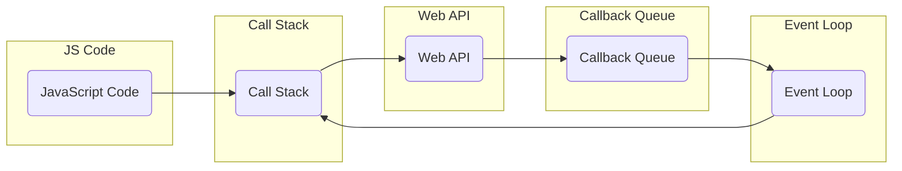

# Asynchronous Programming in JavaScript: An Epic Code Journey 🌐

## Sync Vs Async: Unraveling the Plot

### Sync
JavaScript, known for its traditional single-threaded, synchronous nature, resembles the linear progression of classic movie plots (*🎥 Example: "Kaithi" (2019)*). In synchronous programming, code executes sequentially, one statement at a time, crafting a narrative akin to a timeless cinematic experience. The story follows a single timeline, where scenes unfold one after the other in a harmonious sequence.

**Synchronous Example:**
```javascript
console.log("Start");
console.log("Middle");
console.log("End");
```

**Output:**
```
Start
Middle
End
```

### Async
JavaScript, in its evolution, has embraced the paradigm of asynchronous programming, breaking away from the linear constraints of traditional synchronous execution. In asynchronous programming, the script doesn't wait for each statement to complete before moving on to the next one. Instead, it initiates tasks and continues with the execution, allowing other operations to run concurrently.

Imagine the narrative of a modern interactive film (*🎥 Example: "Super Deluxe" (2019)*), where multiple storylines unfold simultaneously, each progressing independently. Similarly, in asynchronous programming, different tasks can be initiated, and the script doesn't stall while waiting for each one to finish. Callbacks or Promises are employed to handle the results of these asynchronous operations once they are completed, contributing to a more dynamic and responsive application.

This asynchronous approach is particularly beneficial for handling time-consuming operations, such as fetching data from a server or processing large sets of information, without blocking the main thread of execution. It allows JavaScript applications to maintain a level of responsiveness, akin to a cinematic experience where various plotlines unfold concurrently, contributing to a more engaging and efficient code execution.

**Asynchronous Example:**
```javascript
console.log("Start");

setTimeout(() => {
  console.log("Inside Timeout");
}, 2000);

console.log("End");
```

**Output:**
```
Start
End
Inside Timeout
```

In the asynchronous example, the code inside `setTimeout` plays a supporting role without blocking the execution of subsequent statements. This flexibility allows the "End" to be logged before the timeout completes, introducing an unexpected twist to the storyline.

## How JS Handles Async Processes: Behind the Scenes

JavaScript orchestrates its asynchronous saga using the Call Stack, Web API, Callback Queue, and Event Loop, akin to the backstage coordination in movie production.

### Call Stack: The Script Unfolds

The Call Stack takes center stage, a data structure tracking function calls in the code. When a function is called, it gracefully enters the stack, and upon completion, exits the stage.

### Web API: Supporting Actors

Web APIs, the supporting actors from the browser environment (DOM, AJAX, Timeout functions), take on asynchronous tasks, allowing the main script to continue its performance.

### Callback Queue: Waiting in the Wings

Once a Web API completes an asynchronous task, it places the corresponding callback function in the Callback Queue, patiently waiting for its cue.

### Event Loop: The Director's Vision

The Event Loop, resembling a vigilant director, constantly scans the Call Stack and Callback Queue. If the Call Stack is vacant, it takes the first callback from the Queue and seamlessly transitions it to the spotlight.

## Visual Representation of Asynchronous Execution: A Cinematic Flowchart



This visual narrative illustrates the flow of asynchronous execution in JavaScript—a well-choreographed dance, from function calls to the Event Loop gracefully handling callbacks.

Understanding these concepts is akin to navigating the plot twists of a Tamil movie. As we venture forward, we'll delve into specific asynchronous patterns, starting with callbacks, addressing common challenges, much like overcoming hurdles in a thrilling movie plot.

Get ready for an epic coding saga, unfolding just like your favorite Tamil movies! 🍿🎬🚀