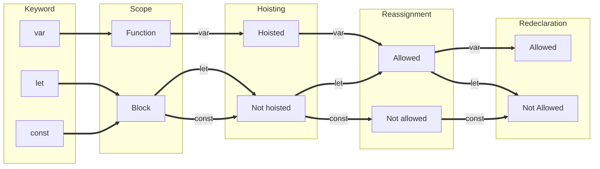
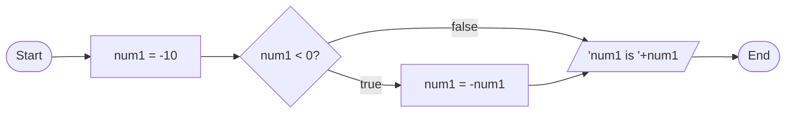
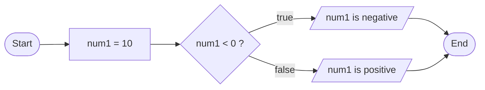
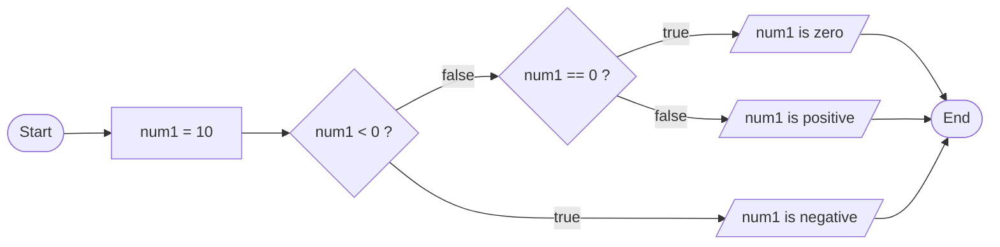
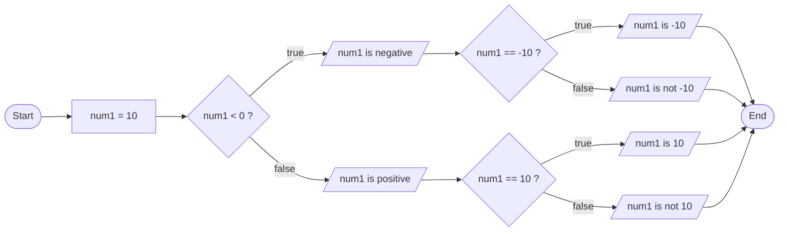
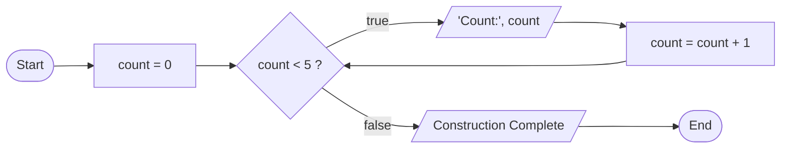
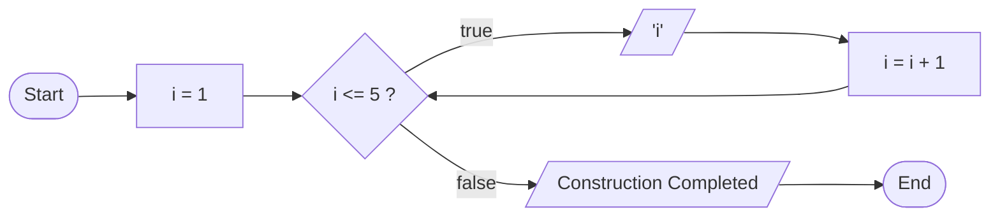
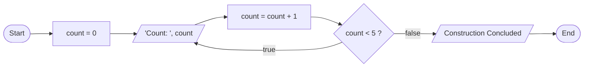

# 1. JavaScript: The Architect of Web Development 🏗️

## 1.1. Introduction

JavaScript serves as the architect in the realm of web development, forming the structural framework alongside HTML and CSS. Positioned as the third layer in the layered language model, JavaScript orchestrates the creation of dynamic and interactive web pages and applications. This versatile, object-oriented scripting language adheres to the ECMAScript specification, embracing a multi-paradigm approach that encompasses event-driven, functional, and imperative programming styles.

## 1.2. Variable: The Cornerstone of Data Management 🧱

### How to Declare a Variable

Declaring a variable involves using the syntax `<keyword> <variable_name> = <value>;`.

For example:
```javascript
var num = 10;
```

### Variable Scope

Variables can be declared globally, locally within a function, or at the block level. The scope defines the region where the variable is accessible.

Example:
```javascript
var num = 10; // global variable

function myFunction() {
  var num = 20; // local variable
  console.log(num); // 20
}

myFunction();

if (num == 10) {
  let temp = num * 2; // block-level variable
  console.log(temp); // 20
}
```

### Variable Naming Convention: Enhancing Readability 📚

Naming conventions contribute to code readability. Here are some commonly used conventions:

- **Camel Case:**
  ```javascript
  var firstName = "Pugazharasan";
  var lastName = "Chandrasekar";
  ```

- **Pascal Case:**
  ```javascript
  class Person {
    constructor(firstName, lastName) {
      this.firstName = firstName;
      this.lastName = lastName;
    }
  }
  ```

- **Snake Case:**
  ```javascript
  var first_name = "Pugazharasan";
  var last_name = "Chandrasekar";
  ```

- **Constant Case:**
  ```javascript
  const PI = 3.14;
  ```

### Keywords in JavaScript: Language Fundamentals 📝

JavaScript includes predefined keywords crucial for defining the structure and behavior of code.

```javascript
var, let, const, function, if, else, for, while, break,
continue, switch, case, default, do, return, try, catch, throw,
typeof, instanceof, new, delete, in, this, super, class,
extends, export, import, async, await, yield, debugger, null,
undefined, true, false, NaN, Infinity
```

### Var, Let, and Const: Managing Declarations 🗂️

- **var:**
  - Declares a variable globally or locally to an entire function, potentially undergoing hoisting.

- **let:**
  - Introduces block scope, restricting visibility to the block, statement, or expression. Does not undergo hoisting.

- **const:**
  - Declares a constant variable with block scope. Immutable after declaration.



## 1.3. Hoisting: Elevating Declarations 🚀

- Hoisting moves variable and function declarations to the top of their scope before code execution.
- Variables declared with `var` are hoisted and initialized with `undefined`.
- Variables declared with `let` and `const` are hoisted but not initialized.

```javascript
console.log(x); // undefined
var x = 10;
console.log(x); // 10

// What happens with let?
console.log(y); // ReferenceError: y is not defined
let y = 20;
console.log(y); // 20
```

JavaScript, as the architect of the web, lays the foundation for dynamic and interactive user experiences. Understanding the nuances of variables and their declarations adds precision to the construction process. 🌐🏗️

# 2. Data Types in JavaScript: Building the Foundation 🏗️

In the world of programming, the concept of **Data Types** is like the foundation of a building. It defines the types of data we use, just as the foundation determines the structure of a construction project.

## 2.1. Number: Measuring the Dimensions 📏

The **Number** data type is akin to the measurements in a construction plan. It's used to store numeric values, combining integers and floating-point numbers.

```javascript
var num = 10;
var num1 = -10.5;
var num2 = 10.5e5; // 1050000
var num3 = 10.5E-5; // 0.000105
console.log(typeof num); // number
```

Here, `num` represents a dimension in our construction, allowing us to quantify values within our JavaScript project.

## 2.2. String: Weaving the Textual Threads 🧵

Strings are the textual threads that bind the elements of a construction project. Just as in construction, where we label and mark components, in programming, we use the **String** data type to store text.

```javascript
var str = 'Hello World';
console.log(typeof str); // string
```

This string, 'Hello World,' is like the label on a construction component, providing a textual identity.

## 2.3. Object: Architectural Blueprint 📐

An **Object** in JavaScript is comparable to an architectural blueprint. It's a collection of key-value pairs that define the structure.

```javascript
var obj = {
  name: 'Pugazharasan C',
  age: 25,
  city: 'Trichy'
};
console.log(typeof obj); // object
console.log(obj.name); // Pugazharasan C
console.log(obj["age"]); // 25
```

In this blueprint, `name`, `age`, and `city` are like architectural elements, defining the structure of our construction.

### Array: Stacking Building Blocks 🧱

An **Array** is like stacking building blocks together. It's a special type of object, storing values in a sequential order.

```javascript
var arr = [1, 2, 3, 4];
console.log(typeof arr); // object
console.log(arr[0]); // 1
console.log(arr[3]); // 4
console.log(arr.length); // 4
```

Here, `arr` holds the building blocks of our construction, each element representing a specific value in the sequence.

### Null: Empty Blueprint 🚫

When our architectural blueprint is yet to be defined, it's like a Null value—a placeholder for future construction.

```javascript
var obj = null;
console.log(typeof obj); // object
```

In this state, the `obj` is akin to an empty construction site waiting for development.

## 2.4. Boolean: Construction Conditions 🚦

Booleans are the construction conditions, representing true or false values. They're integral for decision-making in our construction process.

```javascript
var bool = true;
console.log(bool); // true
console.log(typeof bool); // boolean
```

Just as a traffic light dictates the flow of vehicles, Booleans guide the logic flow of our construction project.

## 2.5. Undefined: Uncharted Territory 🗺️

When a variable is declared but not assigned a value, it's like uncharted territory—a part of our construction project yet to be explored.

```javascript
var name;
console.log(name); // undefined
console.log(typeof undefined); // undefined
```

Here, `name` is undefined, representing an area in our construction project yet to be defined.

## 2.6. Symbol: Unique Building ID 🔍

Symbols are like unique building IDs. They create an immutable and unique identifier for our construction elements.

```javascript
const symbol = Symbol('symbol');
console.log(typeof symbol); // symbol
console.log(symbol); // Symbol(symbol)
```

This unique symbol acts as an ID, ensuring distinct identification within our construction.

## 2.7. BigInt: Precision Engineering 🔧

**BigInt** represents precision engineering in our construction project. It deals with integers of arbitrary precision, offering accuracy in our calculations.

```javascript
const bigInt = BigInt(100000000000000000000000000000000000000000000000000000000000000000000000000000000000000000000000000000000000000000);
console.log(typeof bigInt); // bigint
```

Just as precision engineering ensures accurate measurements, BigInt ensures precise numeric representation.

# 3. Coding Procedure: Architectural Blueprint 📝

When embarking on a coding project, think of it as constructing a building. Here's the architectural blueprint:

1. **Check User Input:**
   - Print user input to the console.
   - Understand the input provided by the user for a clear construction plan.

2. **Format Input:**
   - Transform input into a consistent format, aligning with the requirements of your program.
   - Ensure the input aligns with the

 construction specifications.

3. **Implement Logic:**
   - Develop the main logic, breaking down the problem into manageable steps.
   - Ensure the logic aligns with the overall goal of your construction project.

By following this architectural blueprint, you create a structured approach to coding—making it easier to understand, maintain, and debug your code.

In the realm of CodeKata, this architectural approach ensures a well-constructed and efficient coding structure. For a detailed explanation, refer to [CODEKATA_JS.md](CODEKATA_JS.md). 🏢

# 4. Typecasting in JavaScript: Shaping the Material 🔄

Typecasting, much like shaping raw materials into a specific form, involves converting data from one type to another—a common operation in the construction of programs.

## 4.1. String to Number: Forging Numeric Foundations 🔢

In the vast landscape of JavaScript, converting a string to a number is akin to forging a numeric foundation. Let's explore the methods at our disposal:

1. **Using `parseInt`:**
    ```javascript
   var num = parseInt("1234");
   ```

2. **Using `parseFloat`:**
    ```javascript
    var num = parseFloat("1234.5");
    ```

3. **Using `Number`:**
   ```javascript
   var num = Number("1234.5");
   ```

4. **Using `+` Operator:**
   ```javascript
   var num = +"1234";
   ```

Select the method that aligns with the blueprint of your requirements. Each method has its purpose, so carefully consider the specific needs of your code during this forging process.

```javascript
let num1 = Number("12js4.5"); // NaN
let num2 = parseInt("12js4.5"); // 12
```

## 4.2. Array of Strings to Array of Numbers: Crafting Numeric Arrays 🛠️

### `.map(Number)`

In the construction of JavaScript arrays, transforming strings into numbers is akin to crafting numeric arrays. The `.map(Number)` technique is our artisanal tool for this endeavor:

   ```javascript
   var arr = ["10", "20", "30"];
   var numArr = arr.map(Number)
   console.log(numArr); // [10, 20, 30]
   ```

   **Explanation:**
   1. The `map` function is our artisanal method, iterating over each element of the array.
   2. The `Number` function acts as our crafting tool, transforming strings into numeric elements during the mapping process.
   3. The resulting array, `numberArray`, emerges as a finely crafted array of numbers.

   ```
   +--------------------+                +-------------------+
   |   Array of         |                |   Array of        |
   |   Strings          |  .map(Number)  |   Numbers         |
   | ["10", "20", "30"] |  ------------> | [10, 20, 30]      |
   |                    |                |                   |
   +--------------------+                +-------------------+
   ```

   :book: **Details:** For an in-depth understanding of the Map function, refer to the detailed guide [MRF.md](MRF.md).

## 4.3. Number to String: Molding Textual Structures 🖌️

In the artistry of programming, molding numerical entities into strings is comparable to shaping textual structures. Let's explore the methods of this transformation:

1. **Using `toString`:**
   ```javascript
   var num = 1234;
   var str = num.toString();
   console.log(str); // "1234"
   ```

2. **Using `String`:**
   ```javascript
   var num = 1234;
   var str = String(num);
   console.log(str); // "1234"
   ```

3. **Using `+` Operator:**
   ```javascript
   var num = 1234;
   var str = ""+num;
   console.log(str); // "1234"
   ```

In this artistic process, numeric entities are gracefully molded into strings—shaping the textual landscape of our construction.

These typecasting techniques are the craftsman's tools, allowing you to shape and mold data according to the unique blueprint of your programming project. 🛠️

# 5. JavaScript Operators: Navigating the Blueprint 🚀

## 5.1. Arithmetic Operators: Crafting Mathematical Foundations 📐

Arithmetic operators lay the groundwork for mathematical operations, defining the blueprint for numerical constructions.

### Addition (`+`): Unifying Numeric Entities

```javascript
var num = 10;
var num2 = 20;
var sum = num + num2;
console.log(sum); // 30
```

**Note:** The addition operator also serves as a connector, capable of concatenating strings.

### Subtraction (`-`): Carving out Differences

```javascript
var num = 10;
var num2 = 20;
var diff = num - num2;
console.log(diff); // -10
```

### Multiplication (`*`): Cultivating Numeric Growth

```javascript
var num = 10;
var num2 = 20;
var prod = num * num2;
console.log(prod); // 200
```

### Division (`/`): Shaping Quotients

```javascript
var num = 10;
var num2 = 20;
var quot = num / num2;
console.log(quot); // 0.5
```

**Note:** The division operator returns the quotient, a foundational aspect of numerical structures.

### Modulus (`%`): Crafting Remainders

```javascript
var num = 10;
var num2 = 20;
var mod = num % num2;
console.log(mod); // 10
```

**Note:** The modulus operator crafts remainders, adding a unique dimension to numerical blueprints.

## 5.2. Relational Operators: Comparing Blueprints 🔄

Relational operators facilitate blueprint comparisons, generating either `true` or `false` outcomes.

### Less Than (`<`): Defining Hierarchies

```javascript
console.log(10 < 20) // true
console.log(10 < 10) // false
console.log(10 < 0) // false
```

### Greater Than (`>`): Ascending Heights

```javascript
console.log(10 > 20) // false
console.log(10 > 10) // false
console.log(10 > 0) // true
```

### Less Than or Equal To (`<=`): Navigating Boundaries

```javascript
console.log(10 <= 20) // true
console.log(10 <= 10) // true
console.log(10 <= 0) // false
```

### Greater Than or Equal To (`>=`): Establishing Inclusivity

```javascript
console.log(10 >= 20) // false
console.log(10 >= 10) // true
console.log(10 >= 0) // true
```

### Equal To (`==`): Evaluating Equal Foundations

```javascript
console.log(10 == 20) // false
console.log(10 == 10) // true
console.log(10 == 0) // false
```

**Note:** The equality operator assesses values, disregarding type differences.

### Not Equal To (`!=`): Diverging Paths

```javascript
console.log(10 != 20) // true
console.log(10 != 10) // false
console.log(10 != 0) // true
```

### Strict Equal To (`===`): Enforcing Type and Value Equality

```javascript
console.log(10 === 20) // false
console.log(10 === 10) // true
console.log(10 === 0) // false
```

**Note:** The strict equality operator checks both type and value.

### Strict Not Equal To (`!==`): Upholding Distinctiveness

```javascript
console.log(10 !== 20) // true
console.log(10 !== 10) // false
console.log(10 !== 0) // true
```

## 5.3. Logical Operators: Navigating Expressive Pathways 🛤️

Logical operators pave the way for expressive pathways, combining results into `true` or `false` outcomes.

### Logical AND (`&&`): Coordinating Truths

```javascript
console.log(true && false) // false
```

**Note:** Returns the first `false` expression; if all are `true`, returns the last expression.

### Logical OR (`||`): Uniting Possibilities

```javascript
console.log(true || false) // true
```

**Note:** Returns the first `true` expression; if all are `false`, returns the last expression.

### Logical NOT (`!`): Inverting Perspectives

```javascript
console.log(!true) // false
```

Logical NOT inverts the result of the expression.

The truth table below simplifies the outcomes of logical operators, guiding your navigation through expressive blueprints:

| Expression 1 | Expression 2 |       AND        |         OR         |   NOT    |
| :----------: | :----------: | :--------------: | :----------------: | :------: |
|   `expr1`    |   `expr2`    | `expr1 && expr2` | `expr1 \|\| expr2` | `!expr1` |
|     true     |     true     |       true       |        true        |  false   |
|     true     |    false     |      false       |        true        |  false   |
|    false     |     true     |      false       |        true        |   true   |
|    false     |    false     |      false       |       false        |   true   |

## 5.4. Assignment Operators: Crafting Variable Destinies 🎨

Assignment operators embark on the journey of crafting destinies for variables, guiding them through dynamic transformations.

### Assignment (`=`): Anchoring Values

```javascript
var num = 10;
```

### Addition Assignment (`+=`): Augmenting Numeric Essence

```javascript
var num = 10;
num += 20; // num = num + 20;
console.log(num); // 30
```

**Note:** The addition assignment operator seamlessly blends values, creating a harmonious numeric composition.

### Subtraction Assignment (`-=`): Sculpting Numerical Paths

```javascript
var num = 10;
num -= 20; // num = num - 20;
console.log(num); // -10
```

### Multiplication Assignment (`*=`): Nurturing Multiplicative Bonds

```javascript
var num = 10;
num *= 20; // num = num * 20;
console.log(num); // 200
```

## 5.5. Conditional Operator: Navigating Decision Crossroads 🛤️

The conditional operator guides you through decision crossroads, paving the way for diverse paths.

### Ternary Operator (`? :`): Choosing Destiny

```javascript
var num = 10;
var num2 = 20;
var result = (num > num2)? "num is greater than num2" : "num is less than num2";
console.log(result); // num is greater than num2
```

Navigate the realms of conditions, sculpting destinies based on true or false revelations.

## 5.6. Bitwise Operators: Weaving Binary Narratives 🧵

Bitwise operators intricately weave binary narratives, unveiling the hidden stories within integers.

### Bitwise AND (`&`): Harmonizing Binary Threads

```javascript
var num1 = 10;              // 1010
var num2 = 15;              // 1111
var result = num1 & num2;   //----- &
console.log(result); // 10  // 1010
```

### Bitwise OR (`|`): Uniting Binary Realms

```javascript
var num1 = 10;              // 1010
var num2 = 15;              // 1111
var result = num1 | num2;   //----- |
console.log(result); // 15  // 1111
```

### Bitwise NOT (`~`): Inverting Binary Perspectives

```javascript
var num1 = 10;               // 00001010
var result = ~num1;          //--------- ~
console.log(result); // -11  // 11110101
```

**Note:** Bitwise NOT unveils the inverse binary panorama, exposing the hidden nuances.

### Bitwise XOR (`^`): Pulsating Binary Rhythms

```javascript
var num1 = 10;              // 00001010
var num2 = 15;              // 00001111
var result = num1 ^ num2;   //--------- ^
console.log(result); // 15  // 00000101
```

### Left Shift (`<<`): Shaping Binary Horizons

```javascript
var num1 = 10;              // 00001010
var num2 = 2;
var result = num1 << num2;
console.log(result); // 40  // 00101000
```

**Note:** Left shift expands the binary landscape, multiplying the value by 2 to the power of the specified bits.

### Right Shift (`>>`): Navigating Binary Constricts

```javascript
var num1 = 10;              // 00001010
var num2 = 2;
var result = num1 >> num2;
console.log(result); // 2  // 00000010
```

**Note:** Right shift contracts the binary terrain, dividing the value by 2 to the power of the specified bits.

## 5.7. Conditional Statements: Guiding Code Through Decision Crossroads 🚦

Conditional statements act as the vigilant guardians of your code, steering it through diverse paths based on logical conditions.

### If Statement: Navigating Singular Paths 🛣️

The `if` statement charts a course through a singular path, executing a block of code if a specified condition holds true.

#### Syntax: Defining the Decision Point

```javascript
if (condition) {
  // Code block to be executed if the condition is true
}
```

#### Example: Unveiling the Positive Essence

```javascript
let num1 = 10;
let num2 = 20;

let diff = num1 - num2;

if (diff < 0) {
  // This block will only be executed if the diff is negative
  diff = -diff; // Equivalent to diff = diff * -1;
}

console.log("The difference is: " + diff); // The difference is: 10
```

#### Output: Illuminating the Path

```vbnet
The difference is: 10
```

#### Flowchart: Visualizing the Journey



### If...else Statement: Bifurcating Destinies 🌐

The `if...else` statement gracefully bifurcates destinies, guiding the code through alternative paths based on the truth of a condition.

#### Syntax: Crafting Alternatives

```javascript
if (condition) {
  // Code block to be executed if the condition is true
} else {
  // Code block to be executed if the condition is false
  // This block is optional
}
```

#### Example: Embracing Positivity

```javascript
let num1 = 10;

if (num1 < 0) {
  console.log("num1 is negative");
} else {
  console.log("num1 is positive");
}
```

#### Output: Echoes of Positivity

```vbnet
num1 is positive
```

#### Flowchart: Navigating the Choices



### If...else if...else Statement: Orchestrating Multiple Paths 🌈

The `if...else if...else` statement orchestrates a symphony of paths, selecting the one true melody based on multiple conditions.

#### Syntax: Harmonizing Choices

```javascript
if (condition1) {
  // Code block to be executed if condition1 is true
} else if (condition2) {
  // Code block to be executed if condition1 is false and condition2 is true
} else {
  // Code block to be executed when none of the conditions is true
}
```

#### Example: Embracing Positivity, One Step Further

```javascript
let num1 = 10;

if (num1 < 0) {
  console.log("num1 is negative");
} else if (num1 === 0) {
  console.log("num1 is zero");
} else {
  console.log("num1 is positive");
}
```

#### Output: Celebrating Positivity

```vbnet
num1 is positive
```

#### Flowchart: Guiding Through Choices



### Nested If...else Statement: Unveiling Layers of Choices 🌌

The nested `if...else` statement delves into layers of choices, offering intricate paths based on conditions within conditions.

#### Syntax: Unraveling Layers

```javascript
if (condition1) {
  // Code block to be executed if condition1 is true
  if (condition2) {
    // Code block to be executed if

 condition1 is true and condition2 is true
  } else {
    // Code block to be executed if condition1 is true and condition2 is false
  }
} else {
  // Code block to be executed if condition1 is false
  if (condition3) {
    // Code block to be executed if condition1 is false and condition3 is true
  } else {
    // Code block to be executed if condition1 is false and condition3 is false
  }
}
```

#### Example: Embracing Positivity with Layers

```javascript
let num1 = 10;

if (num1 < 0) {
  console.log("num1 is negative");
  if (num1 === -10) {
    console.log("num1 is -10");
  } else {
    console.log("num1 is not -10");
  }
} else {
  console.log("num1 is positive");
  if (num1 === 10) {
    console.log("num1 is 10");
  } else {
    console.log("num1 is not 10");
  }
}
```

#### Output: Exploring Positive Layers

```vbnet
num1 is positive
num1 is 10
```

#### Flowchart: Navigating Through Layers



Embark on the journey of conditional statements, where each decision opens new avenues for your code to explore. 🚀

# 6. Looping Statements: Constructing Repetitive Structures 🏗️

Looping statements lay the foundation for the architectural dance of repetition in your code. Let's construct the three main structures: `while` loop, `for` loop, and the resilient `do...while` loop.

## 6.1. While loop: Laying the Bricks 🧱

The `while` loop is like laying bricks, building your code upward. It repeats a code block as long as a specified condition is true, ensuring a sturdy structure.

### Syntax: Blueprint for Repetition

```javascript
while (condition) {
   // Build the block
}
```

### Example: Building the Counting Tower

```javascript
let count = 0;

while (count < 5) {
   console.log("Count:", count);
   count++;
}

console.log("Construction Complete");
```

### Output: Rising Structure

```vbnet
Count: 0
Count: 1
Count: 2
Count: 3
Count: 4
Construction Complete
```

### Flowchart: Visualizing the Ascent



### Explanation:

- The `while` loop checks the condition before elevating the structure.
- Ideal for scenarios where the condition may not be met initially.
- The condition `count < 5` ensures the loop keeps constructing until `count` reaches 5.
- The increment `count++` ensures that the loop moves toward completion.

## 6.2. For loop: Blueprinting the Iterations 🏗️

The `for` loop is your blueprint, defining the structure with precise iterations. It's a systematic approach to constructing repetitive patterns.

### Syntax: Architectural Specifications

```javascript
for (initialization; condition; alteration) {
   // Construct the block
}
```

### Example: Erecting the Numerical Tower

```javascript
for (var i = 1; i <= 5; i++) {
   console.log(i); // 1, 2, 3, 4, 5
}

console.log("Construction Completed");
```

### Output: Towering Heights

```vbnet
1
2
3
4
5
Construction Completed
```

### Flowchart: Visualizing the Blueprint



### Explanation:

- The `for` loop is a structured blueprint, defining the initialization, condition, and alteration.
- Perfect for scenarios where you know the exact number of iterations.
- The loop initializes `i` to 1, increments it until it reaches 5, and constructs the block with each iteration.

## 6.3. do...while loop: Building with Perseverance 🏢

The `do...while` loop is the resilient construction worker, ensuring the building stands strong even after the first iteration.

### Syntax: Perseverance in Construction

```javascript
do {
   // Build the block
} while (condition);
```

### Example: Constructing with Tenacity

```javascript
let count = 0;

do {
   console.log("Count: " + count);
   count++;
} while (count < 5);

console.log("Construction Concluded");
```

### Output: Tenacious Structures

```vbnet
Count: 0
Count: 1
Count: 2
Count: 3
Count: 4
Construction Concluded
```

### Flowchart: Mapping the Tenacious Moves



### Explanation:

- The `do...while` loop ensures the construction block is executed at least once.
- Ideal for scenarios where the first iteration is crucial.
- The condition `count < 5` ensures the loop keeps constructing until `count` reaches 5.
- The increment `count++` ensures that the loop moves toward completion.

With these looping structures, your code becomes an architectural marvel, standing tall with the elegance of repetition. 🌟

# 7. Branching Statement: Choosing Paths Wisely 🛣️

In the intricate world of programming, branching statements guide the flow of your code, choosing different paths based on conditions. Let's delve into the versatile `switch` statement and explore the `break` and `continue` statements.

## 7.1. Switch Statement: Navigating the Options 🔄

The `switch` statement is your compass in a world of multiple choices. It directs your code down specific routes based on the value of an expression.

### Syntax: Blueprint for Choices

```javascript
switch (expression) {
  case value1:
    // Execute code for value1
    break;
  case value2:
    // Execute code for value2
    break;
  default:
    // Execute code when no cases match
}
```

### Example: Deciphering the Day

```javascript
let day = "Monday";

switch (day) {
  case "Monday":
    console.log("Today is Monday");
    break;
  case "Tuesday":
    console.log("Today is Tuesday");
    break;
  // ... cases for other days ...
  default:
    console.log("Invalid day");
}
```

### Output: Navigating the Days

```vbnet
Today is Monday
```

### Flowchart: Visualizing the Choices

```mermaid
graph LR
A([Start]) --> B[day = 'Monday']
B --> C{day == 'Monday'?}
C -->|true| D[/'Today is Monday'/]
D --> F[break]
F --> G[End]
C -->|false| H{day == 'Tuesday'?}
H -->|true| I[/'Today is Tuesday'/]
I --> F
// ... Flowchart continues for other cases ...
H -->|false| J[/'Invalid day'/]
J --> F
```

### Explanation:

- The `switch` statement compares an expression (`day` in this case) with different case values.
- When a case matches, the corresponding code block executes until the `break` statement or the end of the `switch`.
- The `default` case catches scenarios where no case matches.

# 8. Break and Continue: Controlling the Flow 🚦

## 8.1. Break: Halting Execution 🛑

The `break` statement is your emergency stop button. It halts the execution of a loop or switch statement.

### Syntax: The Emergency Brake

```javascript
break;
```

### Example: Finding the Elusive Mango

```javascript
let fruits = ["Banana", "Orange", "Apple", "Mango"];

for (var i = 0; i < fruits.length; i++) {
  if (fruits[i] == "Mango") {
    break; // Emergency stop when Mango is found
    console.log("Mango Found"); // This statement is not executed
  }
  console.log(fruits[i]); // Outputs Banana, Orange, Apple
}

console.log("Loop Finished"); // Executes after the loop halts
```

### Output: Halting at Mango

```vbnet
Banana
Orange
Apple
Loop Finished
```

## 8.2. Continue: Skipping Ahead ⏩

The `continue` statement is your shortcut, skipping the rest of the code in the current iteration and moving on to the next.

### Syntax: The Clever Shortcut

```javascript
continue;
```

### Example: Avoiding Apples

```javascript
let fruits = ["Banana", "Orange", "Apple", "Mango"];

for (var i = 0; i < fruits.length; i++) {
  if (fruits[i] == "Apple") {
    continue; // Skip the rest of the code for Apple
  }
  console.log(fruits[i]); // Outputs Banana, Orange, Mango
}

console.log("Loop Finished"); // Executes after the loop ends
```

### Output: Dodging the Apples

```vbnet
Banana
Orange
Mango
Loop Finished
```

# 9. Other Loops: Exploring Diversity 🔄

## 9.1. For...in Loop: Mapping the Terrain 🗺️

The `for...in` loop is your map, traversing the properties of an object.

### Syntax: Navigating the Properties

```javascript
for (variable in object) {
  // Execute code for each property
}
```

### Example: Mapping a Person

```javascript
let person = {
  name: "Pugazharasan C",
  age: 25,
  city: "Chennai"
};

for (var property in person) {
  console.log(property, '=>', person[property]); // Outputs name => Pugazharasan C, age => 25, city => Chennai
}
```

### Output: Navigating the Person

```vbnet
name => Pugazharasan C
age => 25
city => Chennai
```

## 9.2. For...of Loop: Embracing the Values 🔄

The `for...of` loop is your companion, embracing the values of an iterable object.

### Syntax: Embracing the Values

```javascript
for (variable of iterable) {
  // Execute code for each value
}
```

### Example: Savoring Fruits

```javascript
let fruits = ["Banana", "Orange", "Apple", "Mango"];

for (var fruit of fruits) {
  console.log(fruit); // Outputs Banana, Orange, Apple, Mango
}
```

### Output: Savoring the Fruits

```vbnet
Banana
Orange
Apple
Mango
```

With these branching and looping constructs, your code becomes a well-navigated journey, smoothly flowing through decisions and iterations. 🚀

---

*Thank you for taking the time to read my article. Your engagement is the driving force behind the words on these pages. Whether you found information, inspiration, or simply enjoyed the content, your presence is deeply appreciated. Writing is a shared journey, and I'm grateful to have you as a reader. Cheers to the joy of exploration and discovery! 🌟*

*If you enjoyed the article, consider giving it more stars!*

*With gratitude,*

*Pugazharasan C*
