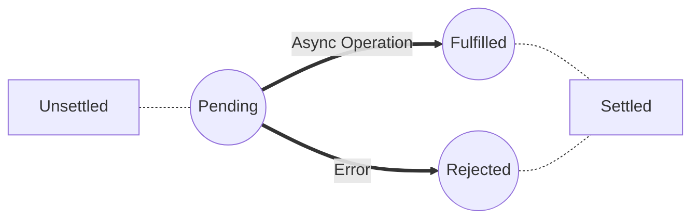

# Promises in JavaScript: A Promising Script 🌟

## Unveiling the Promise

In the world of JavaScript, a Promise unfolds like a plot twist in a suspenseful movie – a powerful mechanism for managing asynchronous operations. It represents the eventual completion or failure of an asynchronous task, offering a structured way to handle outcomes.

## Promise States

A Promise can exist in one of three states:

- **Pending:** The initial state; the promise is awaiting either fulfillment or rejection.
- **Fulfilled:** The operation completed successfully, and the promise holds a resulting value.
- **Rejected:** An error occurred during the operation, and the promise contains a reason for the failure.

## Navigating Promise States: A Visual Guide



This visual representation illustrates the flow of Promise states from Pending to Fulfilled or Rejected based on the outcome of an asynchronous operation.

## Crafting a Promise
In JavaScript, a Promise is an object representing the eventual completion or failure of an asynchronous operation. Promises are used to handle asynchronous operations, making it easier to write asynchronous code in a more organized and readable manner.

Here's an example of how you can craft a Promise:

```javascript
const myPromise = new Promise((resolve, reject) => {
    // Simulating an asynchronous operation (e.g., fetching data from an API)
    setTimeout(() => {
        const success = true; // Simulating a successful operation, set to false for failure

        if (success) {
        // If the operation is successful, resolve the Promise
        resolve('Data successfully fetched');
        } else {
        // If there's an error, reject the Promise
        reject('Error fetching data');
        }
    }, 2000); // Simulating a delay of 2 seconds
});
```
In this example:

1. Inside the Promise constructor, there's a simulated asynchronous operation using `setTimeout`.
2. If the operation is successful, the Promise is resolved with a message; otherwise, it is rejected with an error message.

You can customize the constructor function to perform any asynchronous operation, such as making an API request, reading a file, or querying a database. The key is to ensure that the Promise is appropriately resolved or rejected based on the outcome of the asynchronous operation.

## Handling Promises: then(), catch() and finally()
In JavaScript Promises, the `then` and `catch` methods are used to handle the resolution and rejection of a Promise, respectively. Here's a breakdown of their usage:

1. **`then` method:**
   - It is used to handle the fulfillment (success) of a Promise.
   - It takes one or two optional callback functions as arguments.
   - The first callback is called when the Promise is resolved.
   - The second callback (optional) is called when the Promise is rejected.
   - The `then` method returns a new Promise, allowing for chaining.

   ```javascript
   // Using then for handling fulfillment
   promiseObject.then(
     (result) => {
       // Handle success
       console.log(result);
     },
     (error) => {
       // Handle rejection (optional)
       console.error(error);
     }
   );
   ```

2. **Chaining `then` methods:**
   - You can chain multiple `then` methods to handle a sequence of asynchronous operations.
   - Each `then` in the chain receives the result of the previous `then`'s callback.

   ```javascript
   promiseObject
     .then((result1) => {
       // Handle result1
       return result1 + 1;
     })
     .then((result2) => {
       // Handle result2 (which is result1 + 1)
       console.log(result2);
     })
   ```

3. **`catch` method:**
   - It is used to handle the rejection (failure) of a Promise.
   - It takes a callback function that is called when the Promise is rejected.
   - It is an alternative to providing the rejection callback in the `then` method.

   ```javascript
   promiseObject.catch((error) => {
     // Handle rejection
     console.error(error);
   });
   ```
    Certainly! Let's add the `finally` method and modify the example to remove chaining:


1. **`finally` method:**
   - The `finally` method is used to specify a callback function to be executed regardless of whether the Promise is fulfilled or rejected.
   - It's often used for cleanup operations.

    ```javascript
    promiseObject
    .then((result) => {
        // Handle success
        console.log(result);
    })
    .catch((error) => {
        // Handle rejection
        console.error(error);
    })
    .finally(() => {
        // This block will be executed regardless of the Promise's state
        console.log('Finally block executed');
        });
    ```

    With the addition of the `finally` method, the provided callback will be executed after the Promise is settled, whether it's fulfilled or rejected. This is useful for performing cleanup or finalization steps.

    If you want to avoid chaining, you can structure your code like this:

    ```javascript
    promiseObject
    .then((result) => {
        // Handle success
        console.log(result);
        // Return a new Promise for the next step
        return someOtherPromise();
    })
    .catch((error) => {
        // Handle rejection
        console.error(error);
    })
    .finally(() => {
        // This block will be executed regardless of the Promise's state
        console.log('Finally block executed');
    });
    ```

    In this structure, each `then` block returns a new Promise for the next step, allowing you to handle asynchronous operations sequentially without chaining.

4. **Combining `then`, `catch` and `finally`:**
   - You can use both `then` and `catch` for more fine-grained control.
   - The `catch` method will catch any rejection that occurs in the preceding `then` methods in the chain.

   ```javascript
   promiseObject
    .then((result) => {
      // Handle success
      console.log(result);
    })
    .catch((error) => {
      // Handle rejection
      console.error(error);
    });
    .finally(() => {
       // This block will be executed regardless of the Promise's state
       console.log('Finally block executed');
    });
   ```

    Here, `then()` manages fulfilled promises, `catch()` handles rejections and `finally()` ensures a block of code is executed regardless of fulfillment or rejection.

These methods provide a powerful way to structure and handle asynchronous code in a readable and organized manner.


## resolve() and reject(): Static Methods
Certainly! In JavaScript Promises, the `Promise` object provides two static methods: `resolve()` and `reject()`. These methods are used to create and return resolved or rejected Promise instances, respectively.

1. **`Promise.resolve()` method:**
   - It returns a Promise object that is resolved with a given value or the result of another Promise.
   - If the provided value is a Promise, it is returned as is.

   ```javascript
   const resolvedPromise = Promise.resolve('Resolved value');

   resolvedPromise.then((result) => {
     console.log(result); // Output: Resolved value
   });
   ```

   In this example, `Promise.resolve()` creates a Promise that is immediately resolved with the value `'Resolved value'`.

   ```javascript
   const anotherPromise = new Promise((resolve, reject) => {
     // Some asynchronous operation
     resolve('Async operation resolved');
   });

   const resolvedWithPromise = Promise.resolve(anotherPromise);

   resolvedWithPromise.then((result) => {
     console.log(result); // Output: Async operation resolved
   });
   ```

   Here, `Promise.resolve()` is used to create a Promise that is resolved with the result of the asynchronous operation represented by `anotherPromise`.

2. **`Promise.reject()` method:**
   - It returns a Promise object that is rejected with a given reason (error).
   - Similar to `Promise.resolve()`, if the provided value is a Promise, it is returned as is.

   ```javascript
   const rejectedPromise = Promise.reject('Error reason');

   rejectedPromise.catch((error) => {
     console.error(error); // Output: Error reason
   });
   ```

   In this example, `Promise.reject()` creates a Promise that is immediately rejected with the reason `'Error reason'`.

   ```javascript
   const anotherPromise = new Promise((resolve, reject) => {
     // Some asynchronous operation that fails
     reject('Async operation failed');
   });

   const rejectedWithPromise = Promise.reject(anotherPromise);

   rejectedWithPromise.catch((error) => {
     console.error(error); // Output: Async operation failed
   });
   ```

   Here, `Promise.reject()` is used to create a Promise that is rejected with the reason from the failed asynchronous operation represented by `anotherPromise`.

These static methods are handy for creating and handling Promises in scenarios where you want to immediately resolve or reject a Promise, or when dealing with asynchronous operations that return Promises.

## Chaining Promises: Sequencing Asynchronous Operations

Chaining promises in JavaScript is a way to sequence asynchronous operations, making code more readable and avoiding callback hell. Here's a simple and easy-to-understand explanation:

1. **Basic Promise Structure:**
   - A promise represents the eventual completion or failure of an asynchronous operation.
   - It has two states: `fulfilled` (resolved) or `rejected` (failed).
   - You can create a promise using the `new Promise` constructor.

   ```javascript
   const myPromise = new Promise((resolve, reject) => {
     // Asynchronous operation
     // If successful, call resolve with a result
     // If there's an error, call reject with an error
   });
   ```

2. **Chaining `then` for Sequencing:**
   - The `then` method is used to handle the result of a successful promise.

   ```javascript
   myPromise
     .then((result) => {
       // Handle the result of the first asynchronous operation
       return result + 1; // Can return a value or a new promise
     })
     .then((newResult) => {
       // Handle the result of the second asynchronous operation
       console.log(newResult);
     })
   ```

3. **Chaining Promises for Sequential Operations:**
   - Each `then` block in the chain receives the result of the previous one.
   - This allows you to sequence asynchronous operations easily.
   - The `catch` method is used to handle errors at any point in the chain.

   ```javascript
   asyncOperation1()
     .then((result1) => {
       // Handle result1
       return asyncOperation2(result1);
     })
     .then((result2) => {
       // Handle result2 (which is the result of asyncOperation2)
       return asyncOperation3(result2);
     })
     .then((result3) => {
       // Handle result3 (which is the result of asyncOperation3)
       console.log(result3);
     })
     .catch((error) => {
       // Handle errors in any stage of the sequence
       console.error(error);
     });
   ```


Chaining promises simplifies the structure of asynchronous code, making it easier to understand and maintain. It ensures a clear flow of execution and provides a centralized place for error handling.

## Promise Methods: Exploring the Arsenal

Certainly! Let's explore the arsenal of Promise methods:

### 1. **Promise.all()**
   - **Purpose:** Resolves when all promises in the iterable are fulfilled or rejects if any promise is rejected.
   - **Usage:**

     ```javascript
     const promises = [promise1, promise2, promise3];
     Promise.all(promises)
       .then((results) => {
         console.log("All promises fulfilled:", results);
       })
       .catch((error) => {
         console.error("At least one promise rejected:", error);
       });
     ```

   - This is useful when you want to wait for multiple asynchronous operations to complete before proceeding.

### 2. **Promise.allSettled()**
   - **Purpose:** Resolves when all promises in the iterable are settled (fulfilled or rejected).
   - **Usage:**

     ```javascript
     Promise.allSettled([promise1, promise2, promise3])
       .then((results) => {
         console.log("All promises settled:", results);
       });
     ```

   - Unlike `Promise.all()`, this method doesn't short-circuit on the first rejection. It waits for all promises to settle, providing information on each.

### 3. **Promise.any()**
   - **Purpose:** Resolves with the value of the first fulfilled promise in the iterable.
   - **Usage:**

     ```javascript
     Promise.any([promise1, promise2, promise3])
       .then((result) => {
         console.log("At least one promise fulfilled:", result);
       });
     ```

   - Useful when you are interested in the result of the first successfully resolved promise.

### 4. **Promise.race()**
   - **Purpose:** Resolves or rejects as soon as one of the promises in the iterable resolves or rejects.
   - **Usage:**

     ```javascript
     Promise.race([promise1, promise2, promise3])
       .then((result) => {
         console.log("The first promise to settle:", result);
       });
     ```

   - Useful when you want the result of the first completed promise, regardless of fulfillment or rejection.

These methods provide flexibility in handling multiple promises, allowing you to tailor your approach based on specific requirements.


## **Promise Methods Comparison**
Certainly! Here's a comparison table for `Promise.all()`, `Promise.allSettled()`, `Promise.any()`, and `Promise.race()`:

| Method                 | Purpose                                            | Resolves When                                   | Rejects When                                                  |
| ---------------------- | -------------------------------------------------- | ----------------------------------------------- | ------------------------------------------------------------- |
| `Promise.all()`        | Waits for all promises to fulfill                  | All promises fulfill                            | Any promise rejects                                           |
| `Promise.allSettled()` | Waits for all promises to settle                   | All promises settle (fulfilled or rejected)     | N/A (Doesn't short-circuit on rejections)                     |
| `Promise.any()`        | Resolves with the first fulfilled promise          | The first promise fulfills                      | All promises reject except the first one                      |
| `Promise.race()`       | Resolves or rejects with the first settled promise | The first promise settles (fulfills or rejects) | The first promise rejects or fulfills (whichever comes first) |

### **Comparison Notes:**
   - `Promise.all()` waits for all promises to fulfill or rejects if any promise is rejected.
   - `Promise.allSettled()` waits for all promises to settle, providing information on each.
   - `Promise.any()` resolves with the value of the first fulfilled promise and rejects only if all promises are rejected.
   - `Promise.race()` resolves or rejects as soon as the first promise settles, whether fulfilled or rejected.

### **Useful Scenarios:**
  - Use `Promise.all()` when you need all promises to succeed before proceeding.
  - Use `Promise.allSettled()` when you want to know the outcome of all promises, regardless of fulfillment or rejection.
  - Use `Promise.any()` when you are interested in the result of the first successfully resolved promise.
  - Use `Promise.race()` when you want the result of the first completed promise, regardless of fulfillment or rejection.

Understanding Promises and their methods is a pivotal step in mastering asynchronous JavaScript. In the upcoming sections, we'll build upon this foundation, exploring more advanced concepts. Get ready for a script filled with promise-induced excitement! 🚀
