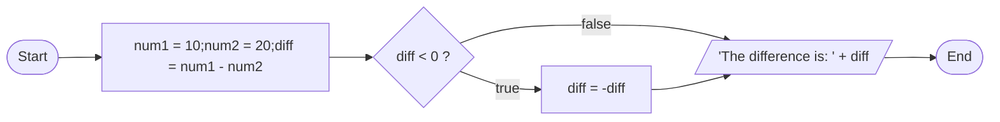

# [JavaScript Cheat Sheet](https://drive.google.com/file/d/14mSzInQ674Drdu_iKULASF1XsCDKjJcm/view?usp=sharing)


- [JavaScript Cheat Sheet](#javascript-cheat-sheet)
- [Variable](#variable)
  - [How to Declare a Variable](#how-to-declare-a-variable)
  - [Variable Scope](#variable-scope)
  - [Variable Naming Convention](#variable-naming-convention)
- [Keywords in JavaScript](#keywords-in-javascript)
  - [List of Keywords:](#list-of-keywords)
- [Var, Let and Const](#var-let-and-const)
- [Data Types in JavaScript](#data-types-in-javascript)
  - [Number](#number)
  - [String](#string)
  - [Object](#object)
    - [Array](#array)
    - [Null](#null)
  - [Boolean](#boolean)
  - [Undefined](#undefined)
  - [Symbol](#symbol)
  - [BigInt](#bigint)
- [Coding Procedure](#coding-procedure)
- [Typecasting in JavaScript](#typecasting-in-javascript)
  - [String to Number](#string-to-number)
  - [Array of Strings to Array of Numbers](#array-of-strings-to-array-of-numbers)
    - [`.map(Number)`](#mapnumber)
  - [Number To String](#number-to-string)
- [JavaScript Operators](#javascript-operators)
  - [Arithmetic Operators](#arithmetic-operators)
  - [Relational Operators](#relational-operators)
  - [Logical Operators](#logical-operators)
  - [Assignment Operators](#assignment-operators)
  - [Conditional Operator](#conditional-operator)
  - [Bitwise Operators](#bitwise-operators)
- [Conditional Statements](#conditional-statements)
  - [**If Statement:**](#if-statement)
  - [**If...else Statement:**](#ifelse-statement)
  - [**If...else if...else Statement:**](#ifelse-ifelse-statement)
  - [**Nested If...else Statement:**](#nested-ifelse-statement)
- [Looping Statements](#looping-statements)
  - [**While loop:**](#while-loop)
  - [**For loop:**](#for-loop)
  - [do...while loop](#dowhile-loop)
- [Branching Statement](#branching-statement)
  - [**switch statement:**](#switch-statement)

# Variable
A value box that can be updated at any time and accessed whenever needed.

## How to Declare a Variable
Use the syntax `<keyword> <variable_name> = <value>;`.

For example:
```javascript
var num = 10;
```
## Variable Scope
A variable can be declared in two different ways:
- **Global Variable:** A variable declared outside of any function is known as a global variable.
- **Local Variable:** A variable declared inside a function is known as a local variable.
- **Block-level Variable:** A variable declared inside a block of code is known as a block-level variable.

  Example:
  ```javascript
  var num = 10; // global variable

  function myFunction() {
    var num = 20; // function-level variable (local to the function)
    console.log(num); // 20
    console.log(window.num); // 20 (assuming it's running in a browser)
    console.log(global.num); // undefined (assuming it's not in a Node.js environment)
    console.log(num); // 20
    console.log(this.num); // 20
  }

  myFunction();

  if (num == 10) {
    let temp = num * 2; // block-level variable
    console.log(temp); // 20
  }
  ```
  - In `myFunction`, when we use `var num = 20;`, we create a local variable named `num` with scope limited to the function.
  - It doesn't affect the global variable `num` (initialized as `var num = 10;`).
  - Inside the function, `num` refers to the local variable. After the function, references to `num` outside it point to the global variable.
  - The term "local variable" in `myFunction` means a variable limited to that function's scope.

## Variable Naming Convention
Naming convention is a set of rules for naming variables. There are many naming conventions.

:memo: **Note:** The naming convention is not enforced by the JavaScript language. It is a convention that is used to improve the readability of the code.

Here are some of the most common ones:
- **Camel Case:** The first letter of each word is capitalized.
  ```javascript
  // used for naming variables and functions
  var firstName = "Pugazharasan";
  var lastName = "Chandrasekar";
  var fullName = firstName + " " + lastName;
  ```
- **Pascal Case:** The first letter of each word is capitalized.
  ```javascript
  // used for naming classes
  class Person {
    constructor(firstName, lastName) {
      this.firstName = firstName;
      this.lastName = lastName;
      this.fullName = firstName + " " + lastName;
    }
  }
  ```
- **Snake Case:** Each word is separated by an underscore.
  ```javascript
  // used for naming variables and functions
  var first_name = "Pugazharasan";
  var last_name = "Chandrasekar";
  var full_name = first_name + " " + last_name;
  ```
- **Kebab Case:** Each word is separated by a hyphen.
  ```javascript
  // used for naming variables and functions
  var first-name = "Pugazharasan";
  var last-name = "Chandrasekar";
  var full-name = first-name + " " + last-name;
  ```
- **Constant Case:** Each word is separated by an underscore and capitalized.
  ```javascript
  // used for naming variables and functions
  const FIRST_NAME = "Pugazharasan";
  const LAST_NAME = "Chandrasekar";
  const FULL_NAME = FIRST_NAME + " " + LAST_NAME;
  ```
// naming convention for boolean variables
- **Boolean Case:** Each word is separated by an underscore and capitalized.
  ```javascript
  // used for naming variables and functions
  var is_logged_in = true;
  var is_logged_out = false;
  ```
- **Boolean Camel Case:** The first letter of each word is capitalized.
  ```javascript
  // used for naming variables and functions
  var isLoggedIn = true;
  var isLoggedOut = false;
  ```
:memo: **Note:** It is not recommended to use camel case for boolean variables.

:memo: **Note:** Variable names should be descriptive and meaningful. Avoid using abbreviations.

# Keywords in JavaScript

Keywords in JavaScript are compiler-known words that are already defined in the programming language itself.

## List of Keywords:

```javascript
var, let, const, function, if, else, for, while, break,
continue, switch, case, default, do, return, try, catch, throw,
typeof, instanceof, new, delete, in, this, super, class,
extends, export, import, async, await, yield, debugger, null,
undefined, true, false, NaN, Infinity
```

These keywords play essential roles in defining the structure and behavior of JavaScript code.

# Var, Let and Const

- **var:**
  - Declares a variable globally or locally to an entire function, regardless of block scope.
  - Can be hoisted to the top of its scope.

  Example:
  ```javascript
  var x = 10;
  function example() {
    var y = 20;
  }
  ```

- **let:**
  - Introduces block scope, limiting the variable's visibility to the block, statement, or expression.
  - Does not hoist to the top of the block.

  Example:
  ```javascript
  let a = 30;
  if (true) {
    let b = 40;
  }
  ```

- **const:**
  - Declares a constant variable with block scope, similar to let.
  - Cannot be reassigned after declaration.

  Example:
  ```javascript
  const PI = 3.14;
  ```

## Hoisting
- Hoisting is a JavaScript mechanism where variables and function declarations are moved to the top of their scope before code execution.
- This means that the variable and function declarations are moved to the top of the function or the global scope.
- This is useful because it allows us to use variables and functions before they are declared.
- It is also useful because it allows us to declare variables and functions in any order.

  ```javascript
  console.log(x); // undefined
  var x = 10;
  console.log(x); // 10
  ```
  In the above example, the variable `x` is declared before it is used. But JavaScript hoists the declaration to the top of the function. That's the reason why the output is `undefined` and not `10`.
  ```javascript
  var x;
  console.log(x); // undefined
  x = 10;
  console.log(x); // 10
  ```
  This is how the variable `x` is hoisted in the above example.

  What will happen when we declare a variable using let in the same way?
  ```javascript
  console.log(x); // ReferenceError: x is not defined
  let x = 10;
  console.log(x); // 10
  ```
  In the above example, the variable `x` is declared using `let` keyword before it is used. Javascript does not hoist the declaration to the top of the function. That's the reason why the output is `ReferenceError: x is not defined` and not `undefined`.

# Data Types in JavaScript

 **Data Type** refers to the type of data we store in programming.

## Number
Number datatype is used to store numeric values. It is the combination of integer and floating point numbers.
- Examples: 1, 2, 3, -1, -5, -100, 10.5, 25.65

  ```javascript
  var num = 10;
  var num1 = -10.5;
  var num2 = 10.5e5; // 1050000
  var num3 = 10.5E-5; // 0.000105
  console.log(typeof num); // number
  ```
:memo: **Note:** typeof returns the data type of the variable.
## String
String datatype is used to store textual data. It is a sequence of characters which is enclosed in double or single quotes.
- Example: `"Hello World"` or `'Hello World'`
  ```javascript
  var str = 'Hello World';
  console.log(typeof str); // string
  ```

## Object
- A collection of key-value pairs.
- Structure: `{<key>: <value>, <key>: <value>,...}`
  ```javascript
  var obj = {
    name: 'Pugazharasan C',
    age: 25,
    city: 'Trichy'
    };
    console.log(typeof obj); // object
    console.log(obj.name); // Pugazharasan C
    console.log(obj["age"]); // 25
  ```
### Array
- A collection of data.
- Array is a special type of object.
- The values are stored in the order in which they are added.
- In order to access the values in an array, we use the index.
- Structure: `[<any number of data>, <any type of data>]`
  ```javascript
  var arr = [1, 2, 3, 4];
  console.log(typeof arr); // object
  console.log(arr[0]); // 1
  console.log(arr[3]); // 4
  console.log(arr.length); // 4
  const dataArray = ['apple', 'banana', 'cherry'];
  const firstElement = dataArray[0]; // 'apple'
  const secondElement = dataArray[1]; // 'banana'
  ```
:memo: **Note:** The length property of an array returns the number of elements in the array.

:memo: **Note:** Index starts from zero(0) and goes to length-1.

### Null
- null is a special keyword that represents the absence of any object value.
  ```javascript
  var obj = null;
  console.log(typeof obj); // object
  ```

## Boolean
- Boolean is a data type that can only have two values: true or false.
- Boolean values are used to represent conditions.
- Example: `if (true) { console.log('True'); }`
  ```javascript
  var bool = true;
  console.log(bool); // true
  console.log(typeof bool); // boolean
  ```
:memo: **Note:** All the relational operators return a boolean value.

## Undefined
- Indicates a variable has been declared but not assigned a value.
- In an Object literal, if a property is not defined, it is automatically assigned the value of undefined.
- Value and the type of undefined are undefined.
- Example:
  ```javascript
  var name;
  console.log(name); // undefined
  var obj = {
    name: 'Pugazharasan C',
    age: 25,
    city: 'Trichy'
    };
    console.log(obj.name); // Pugazharasan C
    console.log(obj.address); // undefined
    console.log(typeof undefined); // undefined
  ```

## Symbol
- An immutable primitive value that is unique.
- Used to create unique identifiers.
- Example:
  ```javascript
  const symbol = Symbol('symbol');
  console.log(typeof symbol); // symbol
  console.log(symbol); // Symbol(symbol)
  ```
## BigInt
- A numeric data type that represents integers with arbitrary precision.
- BigInt is a new data type introduced in ES2020.
- Example:
  ```javascript
  const bigInt = BigInt(100000000000000000000000000000000000000000000000000000000000000000000000000000000000000000000000000000000000000000);
  console.log(typeof bigInt); // bigint
  ```

# Coding Procedure

When starting a coding project, it's essential to follow a systematic procedure for better clarity and efficiency.

1. **Check User Input:**
   - Print user input to the console.
   - Ensure you understand the input provided by the user.

2. **Format Input:**
   - Regardless of the input format, transform it into a consistent format.
   - Make sure the input aligns with the requirements of your program.

3. **Implement Logic:**
   - Develop the main logic to achieve the desired outcome.
   - Break down the problem into smaller, manageable steps.
   - Ensure the logic aligns with the overall goal of the program.

By adhering to this procedure, you create a structured approach to coding, making it easier to understand, maintain, and debug your code.

In order to work in CodeKata you need to follow the coding procedure. For detailed explanation you can refer to the following [CODEKATA JS.md](CODEKATA%20JS.md)

# Typecasting in JavaScript

Typecasting involves converting data from one type to another, and it's a common operation in programming.

## String to Number

In JavaScript, when converting a string to a number, we have several methods to choose from:

1. **Using `parseInt`:**
    ```javascript
   var num = parseInt("1234");
   ```
2. **Using `parseFloat`:**
    ```javascript
    var num = parseFloat("1234.5");
    ```
3. **Using `Number`:**
   ```javascript
   var num = Number("1234.5");
   ```

4. **Using `+` Operator:**
   ```javascript
   var num = +"1234";
   ```

Choose the method that best suits your requirements. Each method has its own use case, so consider the specific needs of your code when performing typecasting.

```javascript
let num = Number("12js4.5"); // NaN
let num = parseInt("12js4.5"); // 12
```

## Array of Strings to Array of Numbers
### `.map(Number)`

   ```javascript
   var arr = ["10", "20", "30"];
   var numArr = arr.map(Number)
   console.log(numArr); // [10, 20, 30]
   ```
   Explanation:
   1. The `map` function is used to iterate over each element of the array.
   2.  The `Number` function is applied to each element during the mapping process, converting strings to numbers.
   1. The resulting array, `numberArray`, contains the converted numbers.
   2. Now you have successfully converted an array of strings to an array of numbers.

   ```
   +--------------------+                +-------------------+
   |   Array of         |                |   Array of        |
   |   Strings          |  .map(Number)  |   Numbers         |
   | ["10", "20", "30"] |  ------------> | [10, 20, 30]      |
   |                    |                |                   |
   +--------------------+                +-------------------+
   ```

## Number To String

1. **Using `toString`:**
   ```javascript
   var num = 1234;
   var str = num.toString();
   console.log(str); // "1234"
   ```
2. **Using `String`:**
   ```javascript
   var num = 1234;
   var str = String(num);
   console.log(str); // "1234"
   ```
3. **Using `+` Operator:**
   ```javascript
   var num = 1234;
   var str = ""+num;
   console.log(str); // "1234"
   ```

# JavaScript Operators
## Arithmetic Operators
Arithmatic operators are used to perform mathematical operations on numbers.
+ **Addition (`+`):**
  ```javascript
  var num = 10;
  var num2 = 20;
  var sum = num + num2;
  console.log(sum); // 30
  ```
  :memo: **Note:** The addition operator can also be used to concatenate strings.

  :info: **Info:** Concatenate means to join two strings together.

+ **Subtraction (`-`):**
  ```javascript
  var num = 10;
  var num2 = 20;
  var diff = num - num2;
  console.log(diff); // -10
  ```

+ **Multiplication (`*`):**
  ```javascript
  var num = 10;
  var num2 = 20;
  var prod = num * num2;
  console.log(prod); // 200
  ```
+ **Division (`/`):**
  ```javascript
  var num = 10;
  var num2 = 20;
  var quot = num / num2;
  console.log(quot); // 0.5
  ```
  :memo: **Note:** The division operator returns the quotient of the division of the first number by the second number.
+ **Modulus (`%`):**
  ```javascript
  var num = 10;
  var num2 = 20;
  var mod = num % num2;
  console.log(mod); // 10
  ```
  :memo: **Note:** The modulus operator returns the remainder of the division of the first number by the second number.

## Relational Operators
Relational operators are used to compare two values. The result of the comparison is either `true` or `false`.
+ **Less Than (`<`):**
  ```javascript
  console.log(10 < 20) // true
  console.log(10 < 10) // false
  console.log(10 < 0) // false
  ```
+ **Greater Than (`>`):**
  ```javascript
  console.log(10 > 20) // false
  console.log(10 > 10) // false
  console.log(10 > 0) // true
  ```
+ **Less Than or Equal To (`<=`):**
  ```javascript
  console.log(10 <= 20) // true
  console.log(10 <= 10) // true
  console.log(10 <= 0) // false
  ```
+ **Greater Than or Equal To (`>=`):**
  ```javascript
  console.log(10 >= 20) // false
  console.log(10 >= 10) // true
  console.log(10 >= 0) // true
  ```
+ **Equal To (`==`):**
  ```javascript
  console.log(10 == 20) // false
  console.log(10 == 10) // true
  console.log(10 == 0) // false
  ```
  :memo: **Note:** The equality operator only check the values not the type. Comparing different type with same valye is considered equal.
  Example:
  ```javascript
  console.log(10 == "10") // true
  console.log(1 == true) // true
  ```
+ **Not Equal To (`!=`):**
  ```javascript
  console.log(10 != 20) // true
  console.log(10 != 10) // false
  console.log(10 != 0) // true
  ```
+ **Strict Equal To (`===`):**
  ```javascript
  console.log(10 === 20) // false
  console.log(10 === 10) // true
  console.log(10 === 0) // false
  ```
  :memo: **Note:** The strict equality operator checks the type and value of the operands. Comparing different type with same value is considered not equal.
  Example:
  ```javascript
  console.log(10 === "10") // false
  console.log(1 === true) // false
  ```
+ **Strict Not Equal To (`!==`):**
  ```javascript
  console.log(10 !== 20) // true
  console.log(10 !== 10) // false
  console.log(10 !== 0) // true
  console.log(10 !== "10") // true
  ```

## Logical Operators
Logical operators are used to combine the results of two or more expressions which are either `true` or `false`.
+ **Logical AND (`&&`):**
  ```javascript
  console.log(true && false) // false
  ```
  :memo: **Note:** The logical AND operator returns the first expression which evaluates to `false`. If all the expressions evaluate to `true`, the logical AND operator returns the last expression.

+ **Logical OR (`||`):**
  ```javascript
  console.log(true || false) // true
  ```
  :memo: **Note:** The logical OR operator returns the first expression which evaluates to `true`. If all the expressions evaluate to `false`, the logical OR operator returns the last expression.

+ **Logical NOT (`!`):**
  ```javascript
  console.log(!true) // false
  ```
  :memo: **Note:** The logical NOT operator is used to negate the result of the expression.

The below table gives the truth table for the logical operators. using this table you can easily understand the logical operators.

| Expression 1  | Expression 2 | AND   |  OR  |  NOT  |
|:--------------:|:--------------:|:------------:|:-----------:|:------------:|
|`expr1`|`expr2`|`expr1 && expr2`|`expr1 \|\| expr2`|`!expr1`|
| true         | true         | true       | true      | false      |
| true         | false        | false      | true      | false      |
| false        | true         | false      | true      | true       |
| false        | false        | false      | false     | true       |


## Assignment Operators
Assignment operators are used to assign values to variables.
+ **Assignment (`=`):**
  ```javascript
  var num = 10;
  ```
+ **Addition Assignment (`+=`):**
  ```javascript
  var num = 10;
  num += 20; // num = num + 20;
  console.log(num); // 30
  ```
  :memo: **Note:** The addition assignment operator is used to add the value of the right operand to the left operand and assign the result to the left operand.
+ **Subtraction Assignment (`-=`):**
  ```javascript
  var num = 10;
  num -= 20; // num = num - 20;
  console.log(num); // -10
  ```
+ **Multiplication Assignment (`*=`):**
  ```javascript
  var num = 10;
  num *= 20; // num = num * 20;
  console.log(num); // 200
  ```

## Conditional Operator
Conditional operator is used to execute a statement if a specified condition is true, otherwise another statement.
+ **Ternary Operator (`? :`):**
  ```javascript
  var num = 10;
  var num2 = 20;
  var result = (num > num2)? "num is greater than num2" : "num is less than num2";
  console.log(result); // num is greater than num2
  ```

## Bitwise Operators
Bitwise operators are used to perform bitwise operations on integers.
+ **Bitwise AND (`&`):**

  Bitwise AND operator returns the bitwise AND of the two operands. The result is 1 if both the bits are 1 and 0 if both the bits are 0.

  ```javascript
  var num1 = 10;              // 1010
  var num2 = 15;              // 1111
  var result = num1 & num2;   //----- &
  console.log(result); // 10  // 1010
  ```
+ **Bitwise OR (`|`):**
  Bitwise OR operator returns the bitwise OR of the two operands. The result is 1 if either of the bits is 1 and 0 if both the bits are 0.

  ```javascript
  var num1 = 10;              // 1010
  var num2 = 15;              // 1111
  var result = num1 | num2;   //----- |
  console.log(result); // 15  // 1111
  ```
+ **Bitwise NOT (`~`):**
  Bitwise NOT operator returns the bitwise NOT of the operand. The result is 0 if the operand is 1 and 1 if the operand is 0.
  ```javascript
  var num1 = 10;               // 00001010
  var result = ~num1;          //--------- ~
  console.log(result); // -11  // 11110101
  ```
  :memo: **Note:** We can calculate the bitwise NOT of a number by doing a simple arithmatic operation.
  ```javascript
  var num1 = 10;
  var result = -(num1+1); // -(10+1) = -11
  console.log(result); // -11
  ```
+ **Bitwise XOR (`^`):**
  Bitwise XOR operator returns the bitwise XOR of the two operands. The result is 1 if the bits are different and 0 if the bits are same.
  ```javascript
  var num1 = 10;              // 00001010
  var num2 = 15;              // 00001111
  var result = num1 ^ num2;   //--------- ^
  console.log(result); // 15  // 00000101
  ```
+ **Left Shift (`<<`):**
  Left shift operator shifts the first operand to the left by the number of bits specified by the second operand.
  ```javascript
  var num1 = 10;              // 00001010
  var num2 = 2;
  var result = num1 << num2;
  console.log(result); // 40  // 00101000
  // Two zero's added at the end of the binary representation of the number
  ```
  :memo: **Note:** The left shift operator is used to multiply the value of the left operand by 2 to the power of the value of the right operand.
  ```javascript
  var num1 = 10;
  var num2 = 2;
  var result = num1 * Math.pow(2, num2); // num1 * num2 ** 2 => 10 * 4 => 40
  console.log(result); // 40
  ```
+ **Right Shift (`>>`):**

  Right shift operator shifts the first operand to the right by the number of bits specified by the second operand.
  ```javascript
  var num1 = 10;              // 00001010
  var num2 = 2;
  var result = num1 >> num2;
  console.log(result); // 2  // 00000010
  // Two bits are removed from the right side of the binary representation of the number
  ```
  :memo: **Note:** The right shift operator is used to divide the value of the left operand by 2 to the power of the value of the right operand.
  ```javascript
  var num1 = 10;
  var num2 = 2;
  var result = parseInt(num1 / Math.pow(2, num2)); // num1 / num2 ** 2 => 10 / 4 => 2
  console.log(result); // 2
  ```
# Conditional Statements
Conditional statements are used to execute a block of code if a specified condition is true, otherwise another block of code.
## **If Statement:**
The if statement is used to execute a block of code if a specified condition is true.
### Syntax
```javascript
if (condition) {
  // code block to be executed
  // if the condition is true
}
```
### Example
```javascript
let num1 = 10;
let num2 = 20;

let diff = num1 - num2;

if(diff < 0) {
  // This block will only be executed if the diff is negative
  diff = -diff; // diff = diff * -1;
}
console.log("The difference is: " + diff); // The difference is: 10

// The difference value is always positive
```
### Output
```vbnet
num is greater than 10
```
### Flowchart

## **If...else Statement:**
The if...else statement is used to execute a block of code if a specified condition is true, otherwise another block of code.

### Syntax
```javascript
if (condition) {
  // code block to be executed
  // if the condition is true
}
else {
  // code block to be executed
  // if the condition is false
  // This block is optional
}
```
### Example
```javascript
let num1 = 10;
if(num1 < 0){
  console.log("num1 is negative");
}
else {
  console.log("num1 is positive");
}
```
### Output
```vbnet
num1 is positive
```
### Flowchart


## **If...else if...else Statement:**
The If ... else if... else statement is silimar to the if...else statement. The only difference is that we can have multiple conditions. When the condition is true, the corresponding block of code is executed. If none of the conditions is true, the last block of code is executed.
### Syntax
```javascript
if (condition1) {
  // code block to be executed
  // if the condition1 is true
}else if (condition2) {
  // code block to be executed
  // if the condition1 is false and the condition2 is true
} else {
  // code block to be executed
  // when none of the conditions is true
}
```
### Example
```javascript
let num1 = 10;
if(num1 < 0) {
  console.log("num1 is negative");
} else if(num1 == 0) {
  console.log("num1 is zero");
} else {
  console.log("num1 is positive");
}
```
### Output
```vbnet
num1 is positive
```
### Flowchart

## **Nested If...else Statement:**
The nested if...else statement is used to execute a block of code if a specified condition is true, otherwise another block of code.

### Syntax
```javascript
if (condition1) {
  // code block to be executed
  // if the condition1 is true
  if (condition2) {
    // code block to be executed
    // if the condition1 is true and the condition2 is true
  } else {
    // code block to be executed
    // if the condition1 is true and the condition2 is false
  }
} else {
  // code block to be executed
  // if the condition1 is false
  if (condition3) {
    // code block to be executed
    // if the condition1 is false and the condition3 is true
  } else {
    // code block to be executed
    // if the condition1 is false and the condition3 is false
  }
}
```
### Example
```javascript
let num1 = 10;
if(num1 < 0) {
  console.log("num1 is negative");
  if(num1 == -10) {
    console.log("num1 is -10");
  }else{
    console.log("num1 is not -10");
  }
} else {
  console.log("num1 is positive");
  if(num1 == 10) {
    console.log("num1 is 10");
  } else {
    console.log("num1 is not 10");
  }
}
```
### Output
```vbnet
num1 is positive
num1 is 10
```
### Flowchart

# Looping Statements
Looping statements are used to execute a block of code repeatedly. There are three types of looping statements in JavaScript:
## **While loop:**
   The while loop is a fundamental control flow statement in JavaScript. It repeatedly executes a block of code as long as a specified condition is true. The condition is checked before executing the block of code.
   ### Syntax
   ```javascript
   while (condition) {
      // code block to be executed
   }
   ```
   ### Example
   ```javascript
   let count = 0;

   while(count < 5) {
      console.log("Count:", count);
      count++;
   }

   console.log("Loop Finished");
   ```
   ### Output
   ```vbnet
   Count: 0
   Count: 1
   Count: 2
   Count: 3
   Count: 4
   Loop Finished
   ```
   ### Flowchart
   ```mermaid
   graph LR
   A([Start]) --> B[count = 0]
   B--> C{count < 5 ?}
   C -->|true| D[/'Count:', count/]
   C -->|false| E[/Loop Finished/]
   D --> F[count = count + 1]
   F --> C
   E --> G([End])
   ```
   ### Explanation:
   + The `while` keyword is followed by a condition in parentheses.
   + If the condition is true, the code block inside the curly braces `{}` is executed.
   + After the block execution, the condition is checked again, and if it's still true, the loop continues.
   + This process repeats until the condition becomes `false`.

   :memo: **Note:** The while loop checks the condition before the block execution. If the condition is initially false, the block of code may not run at all.

## **For loop:**
   The for loop is used to execute a block of code a specified number of times or until the condition fails. The condition is checked after executing the block of code.

   ### Syntax
   ```javascript
   for (initialization; condition; alteration) {
      // code block to be executed
   }
   ```
   ### Example
   ```javascript
   for (var i = 1; i <= 5; i++) {
      console.log(i); // 1, 2, 3, 4, 5
   }
   console.log("Done");
   ```
   ### Output
   ```vbnet
   1
   2
   3
   4
   5
   Done
   ```
   ### Flowchart
   ```mermaid
   graph LR
   A([Start]) --> B[i = 1]
   B--> C{i <= 5 ?}
   C -->|true| D[/'i'/]
   D --> F[i = i + 1]
   C -->|false| E[/Done/]
   F --> C
   E --> G([End])
   ```

   ### Explanation:
   + The `for` keyword is followed by three expressions in parentheses, separated by semicolons.
     + The first expression is executed only once, when the loop starts. This expression is used to initialize the loop variable.
     + The second expression is evaluated before every iteration of the loop. If the expression evaluates to `true`, the loop body is executed. If the expression evaluates to `false`, the loop terminates.
     + The third expression is executed at the end of every iteration of the loop. This expression is used to alter the loop variable, thereby controlling the loop flow.
   + The loop terminates when the condition becomes `false`.


   :memo: **Note:** The for loop can also be used to iterate over an array.
   ```javascript
   var fruits = ["Banana", "Orange", "Apple", "Mango"];
   for (var i = 0; i < fruits.length; i++) {
      console.log(fruits[i]); // Banana, Orange, Apple, Mango
   }
   console.log("Done");
   ```
## do...while loop
   The do...while loop is used to execute a block of code at least once. The condition is checked before executing the block of code.
   ### Syntax
   ```javascript
   do {
      // code block to be executed
      } while (condition);
   ```
   ### Example
   ```javascript
   let count = 0;
   do {
      console.log("Count: " + count);
      count++;
   } while (count < 5);
   console.log("Loop Finished");
   ```
   ### Output
   ```vbnet
   Count: 0
   Count: 1
   Count: 2
   Count: 3
   Count: 4
   Loop Finished
   ```
   ### Flowchart
   ```mermaid
   graph LR
   A([Start]) --> B[count = 0]

   B--> D
   C -->|true| D[/'Count: ', count/]
   C -->|false| E[/Loop Finished/]
   D --> F[count = count + 1]
   F --> C{count < 5 ?}
   E --> G([End])
   ```


   ### Explanation:
   + The `do` keyword is followed by a block of code.
   + The block of code is executed at least once.
   + The `while` keyword is followed by a condition in parentheses.
   + If the condition is true, the code block inside the curly braces `{}` is executed.
   + After the block execution, the condition is checked again, and if it's still true, the loop continues.
   + This process repeats until the condition becomes `false`.
   + The loop terminates when the condition becomes `false`.
   + The do...while loop is similar to the while loop but the condition is checked after executing the block of code.
   + The do...while loop is useful when you want to execute a block of code at least once.

# Branching Statement
Branching statements are used to execute different blocks of code depending on the value of a condition.

## **switch statement:**
The switch statement is used to execute one of multiple blocks of code depending on the value of a variable.
### Syntax
```javascript
switch (expression) {
  case value1:
    // code block to be executed if expression is value1
    break;
  case value2:
    // code block to be executed if expression is value2
    break;
  default:
    // code block to be executed if expression is different from value1 and value2
}
```
### Example
```javascript
let day = "Monday";
switch (day) {
  case "Monday":
    console.log("Today is Monday");
    break;
  case "Tuesday":
    console.log("Today is Tuesday");
    break;
  case "Wednesday":
    console.log("Today is Wednesday");
    break;
  case "Thursday":
    console.log("Today is Thursday");
    break;
  case "Friday":
    console.log("Today is Friday");
    break;
  case "Saturday":
    console.log("Today is Saturday");
    break;
  case "Sunday":
    console.log("Today is Sunday");
    break;
  default:
    console.log("Invalid day");
}
```
### Output
```vbnet
Today is Monday
```
### Flowchart

### Explanation:
+ The switch statement is used to compare a value with multiple values.
+ Switch is an alternative to if...else if...else statements.
+ The `switch` keyword is followed by an expression in parentheses.
+ The expression is evaluated and compared with each case value.
+ If the expression matches a case value, the code block inside the corresponding case is executed untill the last statement of the switch is reached or the `break` keyword is used.
+ If the expression doesn't match any case value, the code block inside the default case is executed.
+ The `break` keyword is used to terminate the switch statement.

